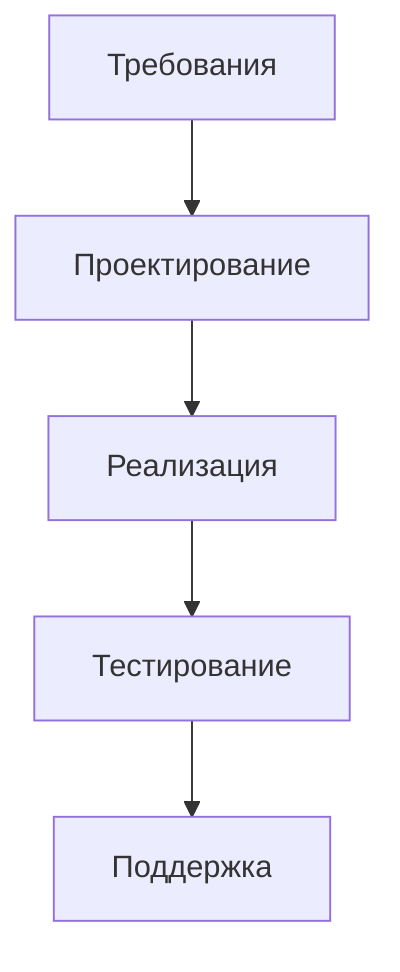
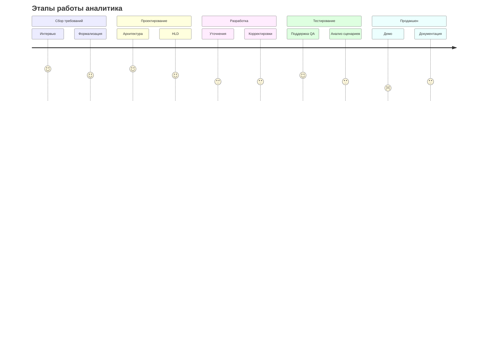

## 1. Современные методологии разработки ПО
### Waterfall (Каскадная модель)

### Agile

## Типы аналитиков
Бизнес аналитик (БА) - бизнес цели, требования со стороны бизнеса. Технические навыки минимальны.
Системный аналитик - технические решения (API, БД, алгоритмы). Технические навыки высокие.
## Роль аналитика по этапам

## Ключевые навыки
-  Нотации (BPMN/UML)
-  Архитектурные паттерны
-  Протоколы данных (REST/GraphQL)
-  Реляционные/NoSQL БД
-  Глубокие знания программирования (опционально)