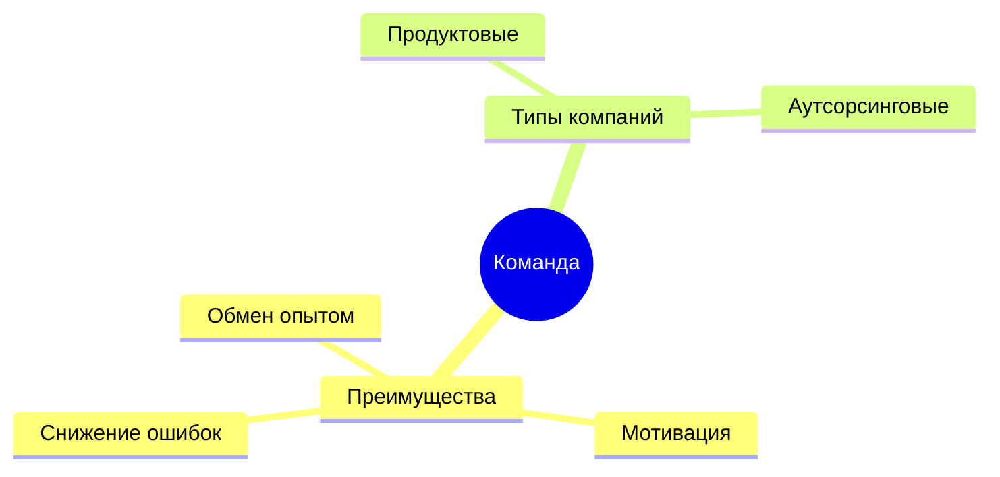
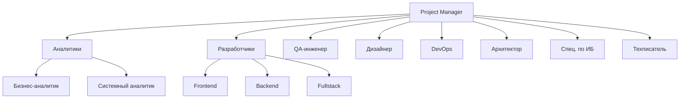
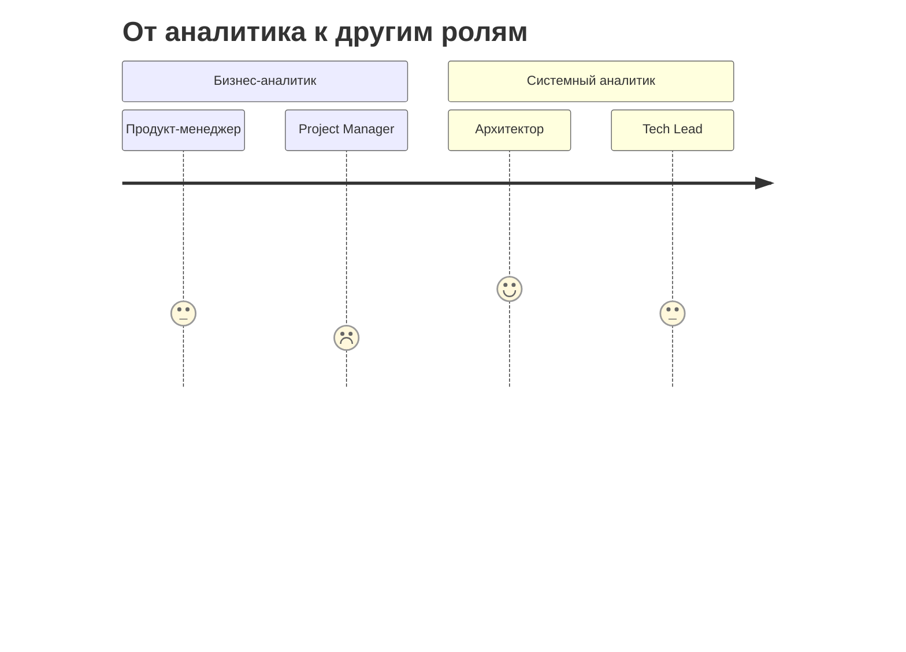

## Команда разработки ПО

- Разработка сложного ПО требует как технических знаний, так и понимания различных областей.
- Командный подход включает обмен опытом, мотивацию и снижение вероятности ошибок.

## Продуктовые команды vs Аутсорсинг

- **Продуктовые компании**:
  - Цель: разработка и выпуск собственного продукта.
  - Примеры: Яндекс, Озон, Сбербанк.

- **Аутсорсинговые компании**:
  - Передача определённых функций другой компании на основании договора.

## Состав команды разработки

- Project Manager
- Системный аналитик
- Frontend-разработчик
- Backend-разработчик
- Fullstack-разработчик
- Менеджер
- QA-инженер
- Бизнес-аналитик
- Дизайнер
- DevOps-инженер
- Архитектор ПО
- Специалист по ИБ
- Технический писатель

## Инструменты

- **Управление проектами и продуктами**:
  - Jira
  - Trello

- **Удалённая связь**:
  - Zoom
  - Skype
  - Mattermost
  - Rocket.chat

- **Сервисы по работе с документами**:
  - Confluence

- **Сервисы для формирования макетов**

- **Системы управления базами данных**

