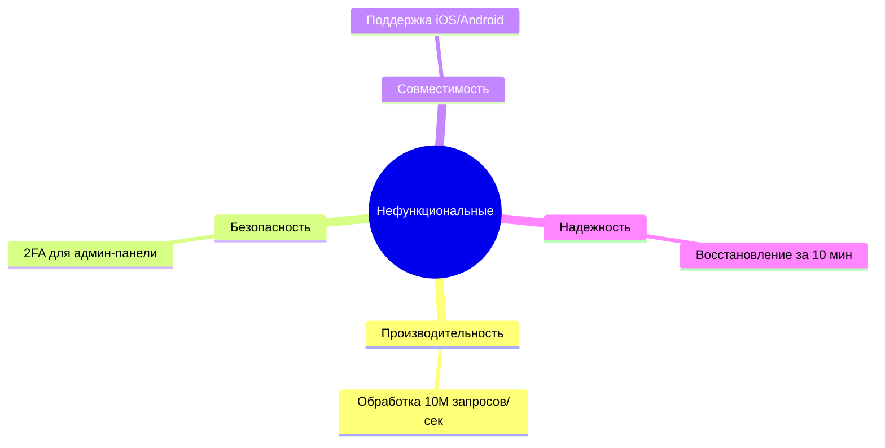

## 1. Определение требований
**По IEEE 610.12-1990:**
- Условия/возможности для решения задач пользователя
- Характеристики системы для соответствия стандартам
- Документированное представление этих условий

**По BABOK Guide:**
- Практическое описание проблемы или возможности
- Демонстрация ценности реализации
- Может быть выражено в любом подходящем формате

## 2. Участники процесса
**Ключевые роли:**
- Стейкхолдеры (заказчики, инвесторы)
- Группы пользователей (классифицируются по):
  - Частоте использования
  - Уровню доступа
  - Технической грамотности

## 3. Виды требований (полная классификация)
### По уровням:
| Тип | Описание | Пример |
|-----|----------|--------|
| Бизнес | Цели компании (SMART-критерии) | "Увеличить CRR на 10% за год" |
| Пользовательские | Потребности конечных пользователей | "Формировать push-уведомления при изменении статуса заявки" |
| Функциональные | Конкретные функции системы | "Кнопка 'Повторить заказ' с редактированием корзины" |

### Нефункциональные требования:

## 4. Свойства качественных требований

**Критерии:**

1. Полнота (охват всех сценариев)
    
2. Ясность (однозначность трактовки)
    
3. Проверяемость (метрики типа "не >1 сек")
    
4. Трассируемость (связь с бизнес-целями)
    
5. Выполнимость (баланс ценности и ресурсов)
## 5. Методы сбора

**Топ-5 методов:**

1. Интервью (глубинное погружение)
    
2. Прототипирование (Figma-макеты)
    
3. Анализ документов (аналогичные системы)
    
4. Наблюдение (за реальными пользователями)
    
5. Семинары (коллективная работа)
## 6. Примеры из практики

**Бизнес-требование:**

> "Повысить выручку от доставки на 5% через программу лояльности с бонусными баллами"

**Функциональное требование:**

```gherkin
Когда пользователь нажимает "Повторить заказ"
Тогда система добавляет товары в корзину
И позволяет редактировать состав
```

**Нефункциональное:**

> "Шифрование персональных данных по стандарту AES-256"
## 7. Шаблоны документов

**SRS (IEEE 29148):**
1. Введение
   - Цели
   - Глоссарий
2. Общее описание
   - Видение продукта
3. Системные требования
   - Функциональные
   - Интерфейсы

### User Story:  
`Как <роль>, я хочу <функция>, чтобы <ценность>`

#бизнес-требования